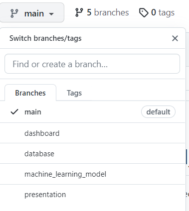
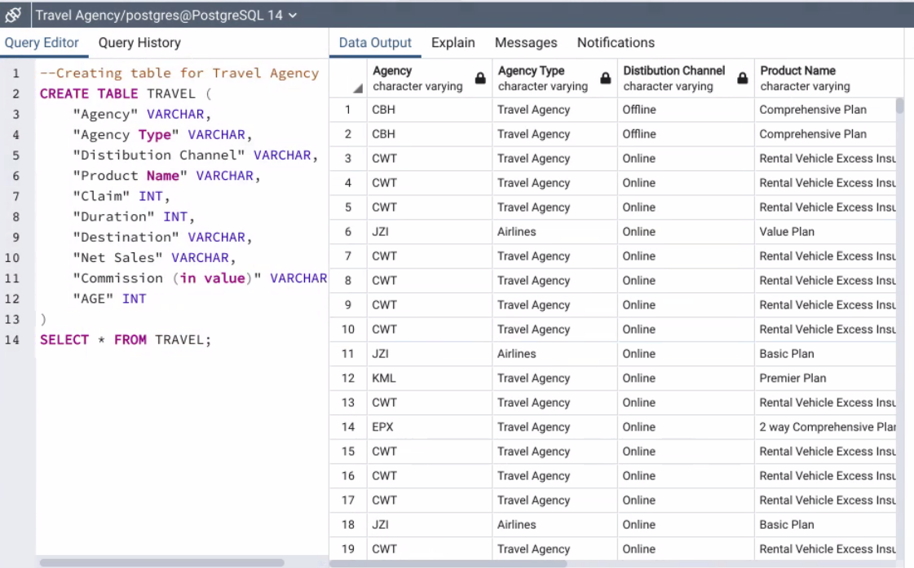

# Data Science Final Project Group 6

## Purpose
The purpose of this project is to demonstrate the skills we developed over our six month data visualization bootcamp class.

### Team Members:
- Liliia Strukova
- Silvia Eiden
- Hina Mahboob
- Maureen Hubka

### Selected topic: 
Travel insurance claims. 
 
### Reason: 
The travel insurance claims dataset was chosen to investigate business opportunities to sell travel insurance. We can investigate the pros and cons of investing in this type of business and gain insight into the market's trends.  We can use Machine Learning to gauge the accuracy of the dataset to see if it can be used to develop a business model plan. 

### Description of the Data:

The Travel Insurance Dataset is from a third-party travel insurance servicing company that is based in Singapore. The dataset was downloaded from Kaggle website. 

https://www.kaggle.com/datasets/mhdzahier/travel-insurance

The following attributes are contained in the dataset:
- Target: Claim Status (Claim.Status)
- Name of agency (Agency)
- Type of travel insurance agencies (Agency.Type)
- Distribution channel of travel insurance agencies (Distribution.Channel)
- Name of the travel insurance products (Product.Name)
- Duration of travel (Duration)
- Destination of travel (Destination)
- Amount of sales of travel insurance policies (Net.Sales)
- Commission received for travel insurance agency (Commission)
- Gender of insured (Gender)
- Age of insured (Age)

### Questions we hope to answer:

- Is there a relationship between travel destination and insurance claims?
- Is there a relationship between type of travel insurance agencies and insurance claims?
- Is there a relationship between duration of travel and insurance claims?
- Is there a relationship between age of insured and insurance claims?
- Can these data points be used to accurately predict insurance claims?
- Does type of sales (i.e.: online, product) affect claims or the amount of insurance sold?
- Are there any other trends that could be used to determine the likelihood of insurance claims being filed?

Answers to these questions can be used to determine sales strategies for areas that are lacking, risky areas to sell travel insurance and if the business is a worthwhile investment. 

## GitHub

A GitHub Main Branch was created with four branches for team members to contribute to, based on the portion of the project being worked on.  The following branches were created and each team member was to have at least four commits from the duration of the first segment.

### Description of the communication protocols:

Communication venues were set up for the team via Slack, Group text, and Zoom meetings. Team members were assigned weekly roles and each member committed the results of their tasks to Git Hub.

## Machine Learning Model

Since our dataset contains labeled data and we know our output, whether the travel insurance was claimed (1) or not (0), we are going to work with classification model of supervised machine learning. We will use Scikit-learn library to implement a machine learning model in Python. Logistic regression was chosen since this is a popular classification model. It predicts binary outcomes, meaning that there are only two possible outcomes.

The dataset was divided into a target and features.  The target is the Claim column and the features are all other columns, beause we want to predict whether or not the person will claim a travel insurance based on different criteria (travel destination, duration, age of insured person, etc.).

Logistics Regression itself gave an accuracy of 98.53% and balanced accuracy score of 50%. This huge difference is because the dataset is not balanced. We can see this also from checking the balance of our target values that show us 61,373 lines of data for not claimed insurance and only 917 lines of data for claimed.

## Database

The Travel Insurance Claims Dataset csv file was downloaded from Kaggle. It was visually analyzed to determine what fields would be most useful. The dataset was cleaned with PANDAS in Jupyter Notebook as followed.

- Gender column was dropped due the large number of null values.
- Claim column transformed to 1 for “yes” and 0 for “no”.
- There were few lines of data with negative and zero values in the Duration column which were dropped. 
- As per boxplot for Age column there were a many of outliers, but 118 is the only large one. Those lines were dropped as well.

It was then pulled into PGADMIN. SQL code was used in query tool to successfully create tables. 

## Dashboard
Tableau will be used as a data visual dashboard for the project. 

## Presentation

Google slides will be used for the demonstation presentation. 

https://docs.google.com/presentation/d/15mORnZ5z8yIWXXm1Pm6wAKRais7dHYS29vaFD6OZ9b4/edit?usp=sharing 

 

