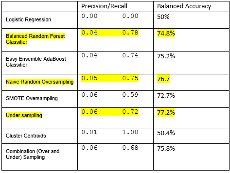

# Data Science Final Project Group 6

## Purpose
The purpose of this project is to demonstrate the skills we developed over our six month data visualization bootcamp class.

## Presentation:

Google Slide Link: [Google Presentation](https://docs.google.com/presentation/d/15mORnZ5z8yIWXXm1Pm6wAKRais7dHYS29vaFD6OZ9b4/edit?usp=sharing)

### Team Members:
- Liliia Strukova
- Silvia Eiden
- Hina Mahboob
- Maureen Hubka

### Selected topic: 
Travel insurance claims. 
 
### Reason: 
The travel insurance claims dataset was chosen to investigate business opportunities to sell travel insurance. We can investigate the pros and cons of investing in this type of business and gain insight into the market's trends.  We can use Machine Learning to gauge the accuracy of the dataset to see if it can be used to develop a business model plan. 

### Description of the Data:

The Travel Insurance Dataset is from a third-party travel insurance servicing company that is based in Singapore. The dataset was downloaded from [Kaggle](https://www.kaggle.com/datasets/mhdzahier/travel-insurance) website.

The following attributes are contained in the dataset:
- Target: Claim Status (Claim.Status)
- Name of agency (Agency)
- Type of travel insurance agencies (Agency.Type)
- Distribution channel of travel insurance agencies (Distribution.Channel)
- Name of the travel insurance products (Product.Name)
- Duration of travel (Duration)
- Destination of travel (Destination)
- Amount of sales of travel insurance policies (Net.Sales)
- Commission received for travel insurance agency (Commission)
- Gender of insured (Gender)
- Age of insured (Age)

### Questions we hope to answer:

- Is there a relationship between travel destination and insurance claims?
- Is there a relationship between type of travel insurance agencies and insurance claims?
- Is there a relationship between duration of travel and insurance claims?
- Is there a relationship between age of insured and insurance claims?
- Can these data points be used to accurately predict insurance claims?
- Does type of sales (i.e.: online, product) affect claims or the amount of insurance sold?
- Are there any other trends that could be used to determine the likelihood of insurance claims being filed?

Answers to these questions can be used to determine sales strategies for areas that are lacking, risky areas to sell travel insurance and if the business is a worthwhile investment. 

## GitHub

A GitHub Main Branch was created with four branches for team members to contribute to, based on the portion of the project being worked on.  The following branches were created and each team member was to have at least four commits from the duration of the first segment.

### Description of the communication protocols:

Communication venues were set up for the team via Slack, Group text, and Zoom meetings. Team members were assigned weekly roles and each member committed the results of their tasks to Git Hub.

## Database

The Travel Insurance Claims Dataset csv file was downloaded from Kaggle. It was visually analyzed to determine what fields would be most useful. The dataset was cleaned with Pandas in Jupyter Notebook as followed:

- Gender column was dropped due the large number of null values.
- Claim column transformed to 1 for “yes” (insurance claimed) and 0 for “no”.
- There were few rows of data with negative and zero values in the Duration column which were dropped. Also, several rows with duration longer than 600 days were dropped - all huge outliers. 
- As per boxplot for Age column the biggest outlier was 118 years - those rows were dropped as well.
- Net Sales and Commission columns were removed to a new DataFrame so our working DataFrame won't be overfitted with unnecessary information.

Cleaned dataset was then imported to PostgreSQL. For these purposes `sqlalchemy` module was used to create the database engine to connect Pandas with SQL. Connection to PostgreSQL was also added to the Jupyter Notebook with Machine Learning Model so the dataset could be imported for further analysis. [Quick DBD](https://www.quickdatabasediagrams.com/) online tool was used to create ERD with relationships.

## Machine Learning Model

Since our dataset contains labeled data and we know our output, whether the travel insurance was claimed (1) or not (0), we worked with the classification model of supervised machine learning. The classification model's algorithms attempt to learn patterns from the data, and if the model is successful, will gain the ability to make accurate predictions for likelihood of claims.

The dataset was divided into a target and features. The target is the Claim column. The features are all the other columns, because we want to predict whether the person will claim a travel insurance based on different criteria (travel destination, duration, age of insured person, etc.).
We used Scikit-learn library to implement a machine learning model in Python. Logistic Regression was chosen since this is a popular classification model. It predicts binary outcomes, meaning that there are only two possible outcomes. The dataset was split into training and testing sets for the supervised learning model. The dataset was split using train_test_split module with 75% of training data and 25% of testing data. The Logistic Regression model learned patterns from the training dataset. It then used the testing dataset to assess its performance.

Logistics Regression itself gave an accuracy of 98.53% and balanced accuracy score of 50%. This huge difference is because the dataset is not balanced. We can see this also from checking the balance of our target values that show us 61,373 lines of data for not claimed insurance and only 917 lines of data for claimed.

Ensemble decision tree models were then used to see how the accuracy scores could be evaluated further to take into consideration the class imbalance, as well as to take into consideration precision and recall. The concept of ensemble learning is the process of combining multiple models, like decision tree algorithms, to help improve the accuracy and robustness, as well as decrease variance of the model, and therefore increase the overall performance of the model.

The following models were used for testing:
- RandomForest
- Adaptive Boosting
- Random Oversampling
- SMOTE
- Random Undersampling
- Cluster Centroid
- SMOTEENN

At first run, as a preprocessing step, we used  get_dummies encoder.  The Balanced Random Forest Classifier, Naive Random Oversampling, and Undersampling models were all considered since they provided the highest scores. Undersampling was then ruled out, because although it had a high Balanced Accuracy score, the Recall score was the lowest. 

The models were then re-run trying OneHotEncoder and LabelEncoder methods, which lowered the scores. The best results were obtained  when get_dummies was applied for all models. Using get_dummies converts categorical data into dummy or indicator variables.  Standard scaler was then applied, and the data was re-run. Variables that are measured at different scales do not contribute equally to the model fitting and model learned function which might end up creating a bias. To deal with this potential problem StandardScaler() module was applied prior to model fitting. Standard scaler improved the scores even more.

Looking at these results RandomForest shows recall of 0.79, however Accuracy is only 71.92% and the difference between Accuracy and Balanced Accuracy is higher versus other models. The accuracy score is lower than the threshold of 75%.  The Balanced Accuracy score for Random Oversampling  and recall decreased from 76.7% to 76.3 and 0.75 to 0.73 respectively. 

The SMOTE model gave the best results at this point. The original SMOTE Balanced Accuracy score was 72.7% and went up to 76.5% after get_dummies and standard scaling was applied.  Accuracy, Precision, and Recall scores for SMOTE were then 78.2%, 0.05, and 0.75 respectively.  The SMOTE model was chosen as our model based on these improved scores.

The benefit of using SMOTE is that unlike oversampling that is random, with SMOTE new instances are interpolated.  New values that are created are based on values of its closest neighbors. 

A limitation to consider when using SMOTE is that, although it reduces the risk of oversampling, it does not always outperform random oversampling. SMOTE also has a vulnerability to outliers and of course sampling techniques cannot overcome the deficiencies of the original dataset.

## Dashboard

Tableau Public Link: [Data Science - Final Project - Group 6]( https://public.tableau.com/views/DataScience-FinalProject-Group6/Story1?:language=en-US&publish=yes&:display_count=n&:origin=viz_share_link)

The purpose of this section is to convey a compelling story of the Travel Insurance Dataset through a series of graphs, and by using Tableau Public we can create visualizations that are easy to read and understand. As a team, we determined Tableau Public is a great tool to add value to our final project as it encourages the viewer to interact with the data for further analysis.

The following interactive elements and types of graphs were used to display the Travel Insurance Dataset in Tableau. 

### Interactive Elements:

- Checkbox filter
- Highlight search bar 
- Hover text and map

### Types of Graphs Used:

- Bar charts
- Pie charts
- Packed Bubbles
- World Map

## Summary and Conclusions

Using the travel insurance dataset, we looked particularly to see if there was a relationship and or predictability that travel insurance would have claims filed based upon the following criteria.

- Travel destination 
- Agency type that sold the insurance
- Duration of travel
- Age of insured
- Type of sales 

However, we were not able to find a relationship that would accurately predict the likelihood of plans having claims filed from the features that we used from this dataset. We did not find any other trends that could be used to predict the likelihood of claims being filed for travel insurance either. Although we had a large dataset of 62,290 plans sold, only 1.47% of those sold had a claim. We think that because the number of claims was so low, we could not find a linear trend to any of the features. Nevertheless, we think we can glean some information from the data that could be considered for a business plan.

Travel duration was the feature had the highest number of claims. The average travel duration is 48.6 days for sold travel insurance plans and 111.7 days for travel insurance plans that had a claim. With this data we can glean that most of the travel insurance customers were doing long term travel.  This could mean these are long term business travelers.  Having more information to see what countries have laws that center around travel insurance requirements could provide more context.

The average age of travel insurance buyers is 36 years old who fall in the age bin of 35-39 years old. That represents 47% of the total travel insurance buyers.  It would be interesting to have more information on this group, such as type of travel (business or pleasure) to see if the theory that these are business travelers holds true.  

The Travel Insurance Dataset is from a third-party travel insurance servicing company that is based in Singapore. As a result, Asia and North America are heavily highlighted with most travel insurance claims in the world map. If we had more time, we would have liked to run data specifically on Singapore. 

?Top 10 destinations displayed in graph: “Top 10 Destinations by Sold and Claimed Insurance Plans”?

The distribution channels columns for the travel insurance plans showed that 1.6% were sold Offline and 98.4% were sold Online. Conversely, 1.3% Offline and 98.7% Online for travel insurance plans that had a claim. The Agency types aggregate for the travel insurance plans was 26.5% Airlines and 73.5% Travel Agency for sold travel insurance plans. Moreover, 64% Airlines and 36% Travel Agency for travel insurance plans that had a claim. This information could be used to decide what venues to invest in for selling the travel insurance.

We can tell from the large dataset that there is a large market for travel insurance in this area of the world.  Many more insurance plans were sold that did not have insurance claims than did.  At first glance this seems like an advantageous business opportunity, but much more information is needed on the net sales and monies that need to be expended when claims are made. Although there was information on Net Sales and Commission in the dataset, we chose to remove them. We did this because we did not have sufficient information on the definitions of the data and did not want to overfit the data frame with information we did not understand, and therefore would not be able to interpret.  Having more information on Net Sales and money expenditure for claims would be most useful in determining the viability of opening a travel insurance business in this part of the world. 

This dataset was from 2019.  It would be really interesting to see how these trends may have changed in our post covid 19 pandemic age. We think travel insurance would be less of an afterthought and more of must during a pandemic. This would be very valuable information to have when deciding whether or not to invest in a travel insurance at this time. 

